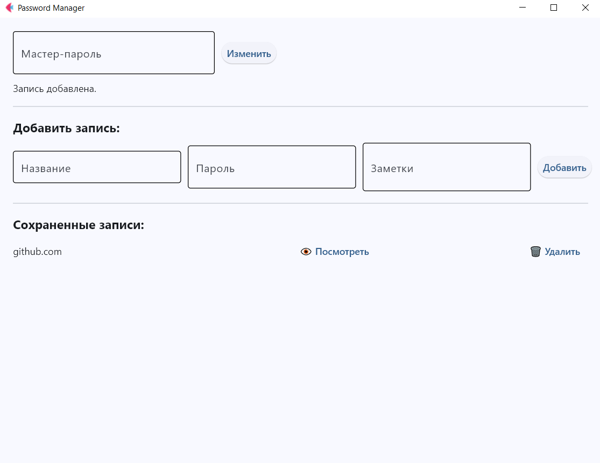

# Password Manager

**Описание**
Desktop-приложение для безопасного хранения паролей одного пользователя. Реализован мастер-пароль, надежное шифрование
записей, проверка сложности паролей и простая работа с записями через UI.



Проект демонстрирует знание:

- Python (ООП, context manager, dataclasses)
- SQLite (создание таблиц, безопасное выполнение запросов, работа с BLOB, атомарные транзакции)
- Безопасного хранения паролей (PBKDF2, Fernet, соль)
- Архитектуры приложения с разделением слоев: UI / бизнес-логика / БД / криптография
- Flet UI для кроссплатформенного интерфейса

---

## Функциональность

- Создание и верификация мастер-пароля
- Добавление, просмотр и удаление записей
- Перешифровка всех записей при смене мастер-пароля
- Базовая проверка сложности пароля при создании

---

## Архитектура

Проект разделен на слои:

1. **CryptoManager** – шифрование и KDF (PBKDF2 + Fernet)
2. **DBManager** – работа с SQLite, хранение зашифрованных данных
3. **PasswordManager** – работа с паролями и мастер-паролем
4. **PasswordManagerUI** – интерфейс на Flet, взаимодействие с пользователем

---

## Требования и запуск

Установка зависимостей:

   ```bash
   pip install -r requirements.txt
   ```

Запуск осуществляется из `main.py`:

---

## Используемые компоненты

- **UI Framework:** [Flet](https://flet.dev) (Apache-2.0)
- **Encryption:** [Cryptography](https://cryptography.io) (Apache-2.0 / BSD-3-Clause)

---

## Лицензия

Данный проект является Open Source и распространяется под лицензией **GNU GPL v3**.  
Полный текст лицензии находится в файле [LICENSE](LICENSE).

---

## Отказ от ответственности (Disclaimer)

Программное обеспечение предоставляется «как есть», без каких-либо гарантий. Автор не несет ответственности за потерю
данных, забытые мастер-пароли или любые другие убытки, возникшие в результате использования данного ПО. Используйте на
свой страх и риск.

